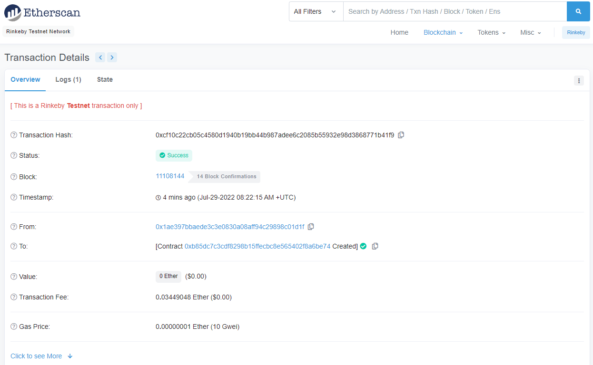

# Decentralised House Listing Solution

The idea behind this project is to buid a decentralised house listing service.  Blockchain technology is used to build immutable digital records of properties and having the transactions handled in a transparent way.

In the project, there is the possibility to verify the property owner using ZK-SNARKs (proves ownership without revealing property information) and minting tokens to represent your title to the property.  Upon verification of the token, it can be placed in the OpenSea marketplace and eventually sold.

# Tools or technologies
This application makes use of a number of libraries.  Below are some of the most important 

* Truffle - v5.5.23 (core: 5.5.23)
* Solidity - 0.5.5
* Node - V12.13.0
* Web3.js - v1.7.4
* Ganache CLI - v7.3.2
* Zokrates - 0.4.10

# Testing the code
The solution has 3 test files *TestERC721Mitable.js*, *TestSquareVerifier.js* and *TestSolnSquareVerifier.js* which test the related contracts.  

To execute all the tests in one fo use the following commands

* `truffle develop`
* `test`

To execute a particular test use any of the below commands 
* `test ./test/TestERC721Mintable.js`
* `test ./test/TestSquareVerifier.js`
* `test ./test/TestSolnSquareVerifier.js`

# Contract information

* Contract Addresses
    * SquareVerifier - 0x6E34464688B549563921ad19303688288cFae649
    

    * SolnSquareVerifier - 0xb85DC7c3CDF8298b15FFEcBC8e565402f8a6be74
    
* Contract ABI - eth_contracts/build/contracts/SolnSquareVerifier.json
* OpenSea MarketPlace Storefront - https://testnets.opensea.io/collection/unidentified-contract-1ha8invzfr
* Testing Minting, Selling & Buying tokens (TX History) - https://rinkeby.etherscan.io/address/0xb85DC7c3CDF8298b15FFEcBC8e565402f8a6be74#internaltx 

# Generating SK_SNARKs
In order to generate the witnesses and proofs using Docker and Zokrates the below commands were executed

>~/zokrates compute-witness -o witnesses/wtkn0 -a 3 9
~/zokrates generate-proof -w witnesses/wtkn0 -j proofs/ptkn0.json

>~/zokrates compute-witness -o witnesses/wtkn1 -a 4 16
~/zokrates generate-proof -w witnesses/wtkn1 -j proofs/ptkn1.json

>~/zokrates compute-witness -o witnesses/wtkn2 -a 5 25
~/zokrates generate-proof -w witnesses/wtkn2 -j proofs/ptkn2.json

>~/zokrates compute-witness -o witnesses/wtkn3 -a 6 36
~/zokrates generate-proof -w witnesses/wtkn3 -j proofs/ptkn3.json

>~/zokrates compute-witness -o witnesses/wtkn4 -a 7 49
~/zokrates generate-proof -w witnesses/wtkn4 -j proofs/ptkn4.json

>~/zokrates compute-witness -o witnesses/wtkn5 -a 8 64
~/zokrates generate-proof -w witnesses/wtkn5 -j proofs/ptkn5.json

>~/zokrates compute-witness -o witnesses/wtkn6 -a 9 81
~/zokrates generate-proof -w witnesses/wtkn6 -j proofs/ptkn6.json

>~/zokrates compute-witness -o witnesses/wtkn7 -a 10 100
~/zokrates generate-proof -w witnesses/wtkn7 -j proofs/ptkn7.json

>~/zokrates compute-witness -o witnesses/wtkn8 -a 11 121
~/zokrates generate-proof -w witnesses/wtkn8 -j proofs/ptkn8.json

>~/zokrates compute-witness -o witnesses/wtkn9 -a 12 144
~/zokrates generate-proof -w witnesses/wtkn9 -j proofs/ptkn9.json`

Note: code to mint tokens can be found in *MintTokens.js*

# Project Resources

* [Remix - Solidity IDE](https://remix.ethereum.org/)
* [Visual Studio Code](https://code.visualstudio.com/)
* [Truffle Framework](https://truffleframework.com/)
* [Ganache - One Click Blockchain](https://truffleframework.com/ganache)
* [Open Zeppelin ](https://openzeppelin.org/)
* [Interactive zero knowledge 3-colorability demonstration](http://web.mit.edu/~ezyang/Public/graph/svg.html)
* [Docker](https://docs.docker.com/install/)
* [ZoKrates](https://github.com/Zokrates/ZoKrates)
